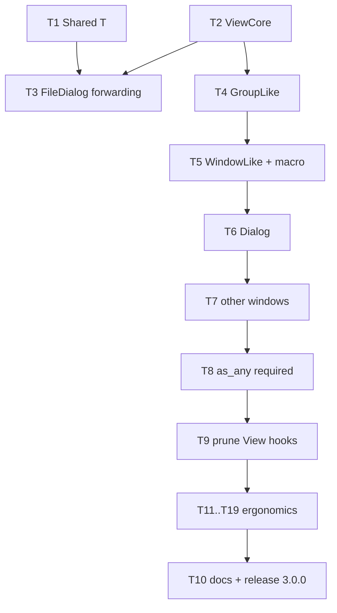

# MISSING-SIMPLE: step-by-step execution guide

This is the low-complexity companion to `MISSING-INHERITANCE.md`. That document contains
the analysis and the reference code. This one contains nothing but instructions: one
small action per checkbox, with the exact command to run and the exact thing to look for.

**Every checkbox here starts unchecked. Nothing in this plan has been done yet.**

---

## How to use this document

Read this section once, then never think about process again.

1. Work top to bottom. Never skip a task. Never start a task whose "Depends on" line
   names a task you have not finished.
2. Do exactly one checkbox at a time. Tick it only after its command printed what the
   checkbox says it should print.
3. Where a step says **copy the code at `MISSING-INHERITANCE.md:NNN-MMM`**, open that
   file, read those line numbers, and copy the code block verbatim. Do not invent your
   own version. `MISSING-INHERITANCE.md` is the single source of truth for code.
4. Line numbers in this file refer to `MISSING-INHERITANCE.md` unless a `src/` path is
   given.

### The three commands

```bash
# A: one module's tests
cargo test --lib <module path>
# B: the whole suite
cargo test
# C: the gate that must pass before any commit
cargo test && cargo build --all-targets && cargo clippy --all-targets -- -D warnings
```

Command C is called **the gate** everywhere below.

### Rules that apply to every step

- No new dependencies. Never edit `Cargo.toml` except where a step says to.
- When you move a method body from one place to another, move it **character for
  character**. The only edits allowed are the field-access rewrites the step lists
  (for example `self.bounds` becomes `self.core.bounds`). If you feel tempted to also
  improve the code, stop: that is a different task.
- Every file keeps its `// (C) 2025 - Enzo Lombardi` or `// (C) 2026 - Enzo Lombardi`
  header line. New files get 2026.
- Commit only at the checkbox that says commit, with the message it gives.

### When to stop and ask

Stop, do not improvise, and report back if any of these happen:

- The gate fails and the failure is not obviously caused by the edit you just made.
- A step tells you a test should fail with error X and it fails with a different error.
- A file does not contain the code the step describes (someone changed it since this
  plan was written).
- A step's line-number reference points at unrelated code.

---

## Order of work



Task 1 and Task 2 touch different files and may be done in either order. Everything
else is strictly sequential. Task 10 is always last.

---

# Part One: the inheritance work

## Task 1 - one generic `Shared<T>`

**Depends on:** nothing.
**Goal:** delete six hand-written `Rc<RefCell<T>>` wrapper structs and replace them with
one generic `Shared<T>`.

- [ ] 1.1 Create the file `src/views/shared.rs` containing only the copyright header, the
      module doc comment, and the `use` lines from `MISSING-INHERITANCE.md:580-598`.
- [ ] 1.2 Append the test module at `MISSING-INHERITANCE.md:537-570` to
      `src/views/shared.rs`.
- [ ] 1.3 Add `pub mod shared;` to `src/views/mod.rs`, in alphabetical position (right
      after `pub mod scroller;`).
- [ ] 1.4 Run `cargo test --lib views::shared`. Expect a **compile error**: the struct
      `Shared` does not exist yet. If it compiles, you added the implementation too early.
- [ ] 1.5 Add the `Shared<T>` struct and its two inherent methods:
      `MISSING-INHERITANCE.md:600-615`.
- [ ] 1.6 Add the whole `impl<T: View> View for Shared<T>` block:
      `MISSING-INHERITANCE.md:617-655`. Do not add `as_any` or `as_any_mut` here; Task 8
      does that.
- [ ] 1.7 Run `cargo test --lib views::shared`. Expect `test result: ok. 2 passed`.
- [ ] 1.8 In `src/views/edit_window.rs`, delete the three structs `SharedScrollBar`,
      `SharedIndicator`, `SharedEditor` together with their `impl View for` blocks
      (around lines 23-165 of that file).
- [ ] 1.9 In `src/views/edit_window.rs`, add `use super::shared::Shared;` and rewrite the
      four construction sites as shown at `MISSING-INHERITANCE.md:670-676`.
- [ ] 1.10 In `src/views/help_window.rs`, delete `SharedHelpViewer` and its `impl View`,
      and replace each `SharedHelpViewer(x)` with `Shared::new(x)`.
- [ ] 1.11 In `src/views/log_window.rs`, delete `SharedTerminalWidget` and its `impl View`,
      and replace each `SharedTerminalWidget(x)` with `Shared::new(x)`.
- [ ] 1.12 In `src/views/chdir_dialog.rs`, delete **only** `SharedScrollBar` and replace
      `SharedScrollBar(x)` with `Shared::new(x)`. **Keep `SharedDirListBox`** - it has
      behaviour of its own and is not a plain forwarder.
- [ ] 1.13 Run `cargo build --all-targets` and delete every `use` line the compiler now
      reports as unused.
- [ ] 1.14 Run the gate. Two named tests must be green:
      `edit_window::tests::editor_follows_window_resize` and
      `help_window::tests::test_help_window_options_delegation`.
- [ ] 1.15 Commit:
```bash
git add src/views/shared.rs src/views/mod.rs src/views/edit_window.rs \
        src/views/help_window.rs src/views/log_window.rs src/views/chdir_dialog.rs
git commit -m "refactor(views): generic Shared<T> replaces six Rc<RefCell> forwarding newtypes"
```

---

## Task 2 - `ViewCore`

**Depends on:** nothing.
**Goal:** the five fields every view copies (`bounds`, `state`, `options`, `grow_mode`,
`palette_chain`) live in one struct, and the ten accessors become trait defaults.

This task is long because it visits 32 files. It is also the most mechanical. The
migration is staged so the crate compiles after every single file - never batch the
files together.

### 2A - add the type

- [ ] 2.1 In `src/views/view.rs`, just after the `impl ViewId` block, paste the `ViewCore`
      struct and its `impl`: `MISSING-INHERITANCE.md:761-781`.
- [ ] 2.2 Add the test at `MISSING-INHERITANCE.md:730-748` into a new `#[cfg(test)] mod
      tests` in `src/views/view.rs` (or the existing one if there is one).
- [ ] 2.3 Run `cargo test --lib views::view::tests`. Expect a compile error naming the
      missing trait items `bounds` / `set_bounds`.
- [ ] 2.4 Inside `pub trait View`, **replace** the ten existing declarations `bounds`,
      `set_bounds`, `state`, `set_state`, `options`, `set_options`, `grow_mode`,
      `set_grow_mode`, `set_palette_chain`, `get_palette_chain` with the block at
      `MISSING-INHERITANCE.md:789-805`. That block also adds `core()` and `core_mut()`
      with a **temporary** `unreachable!` body; this is intentional and removed in 2C.
- [ ] 2.5 Run `cargo test --lib views::view::tests`. Expect PASS.
- [ ] 2.6 Run `cargo test`. Expect everything still green - existing views still override
      the accessors, so nothing has changed for them yet.

### 2B - migrate the leaf views, one file per checkbox

For **each** file below, do these five edits, then run
`cargo test --lib views::<that module>` before moving to the next file:

1. Replace the `bounds`, `state`, `options`, `grow_mode`, `palette_chain` fields in the
   struct with one field `core: ViewCore`.
2. In the constructor, build `core: ViewCore::with_options(bounds, <the options value the
   old constructor used>)`, and assign `core.state` wherever the old code assigned
   `state`. A worked example for `Button` is at `MISSING-INHERITANCE.md:828-850`.
3. Delete the ten accessor methods from `impl View for X` - **but only where the body was
   a plain field read or write**. If `set_bounds` also repositions children, keep it and
   just rewrite the field access.
4. Add `fn core(&self) -> &ViewCore { &self.core }` and
   `fn core_mut(&mut self) -> &mut ViewCore { &mut self.core }` to the `impl View` block.
5. Rewrite the remaining field uses: `self.bounds` to `self.core.bounds`, `self.state` to
   `self.core.state`, `self.options` to `self.core.options`, `self.palette_chain` to
   `self.core.palette_chain`. **Do not touch differently-named fields** such as
   `list_state` on `ListBox` or `cluster_state` on `CheckBox`.

Files, in this order (containers and wrappers are deliberately absent - they are 2C):

- [ ] 2.7 `static_text.rs`
- [ ] 2.8 `label.rs`
- [ ] 2.9 `paramtext.rs`
- [ ] 2.10 `background.rs`
- [ ] 2.11 `ansi_background.rs`
- [ ] 2.12 `button.rs`
- [ ] 2.13 `checkbox.rs`
- [ ] 2.14 `radiobutton.rs`
- [ ] 2.15 `input_line.rs`
- [ ] 2.16 `scrollbar.rs`
- [ ] 2.17 `indicator.rs`
- [ ] 2.18 `frame.rs`
- [ ] 2.19 `listbox.rs`
- [ ] 2.20 `sorted_listbox.rs`
- [ ] 2.21 `file_list.rs`
- [ ] 2.22 `dir_listbox.rs`
- [ ] 2.23 `history.rs`
- [ ] 2.24 `history_viewer.rs`
- [ ] 2.25 `list_viewer.rs` (skip if it declares no base fields)
- [ ] 2.26 `menu_bar.rs`
- [ ] 2.27 `menu_box.rs`
- [ ] 2.28 `status_line.rs`
- [ ] 2.29 `outline.rs`
- [ ] 2.30 `text_viewer.rs`
- [ ] 2.31 `scroller.rs`
- [ ] 2.32 `memo.rs`
- [ ] 2.33 `editor.rs`
- [ ] 2.34 `file_editor.rs`
- [ ] 2.35 `terminal_widget.rs`
- [ ] 2.36 `help_viewer.rs`
- [ ] 2.37 `help_index.rs`
- [ ] 2.38 `help_toc.rs`
- [ ] 2.39 `color_selector.rs`
- [ ] 2.40 `kitty_image.rs`
- [ ] 2.41 `validator.rs` (skip if it holds no view fields)
- [ ] 2.42 Run `cargo test`. Expect green before continuing to 2C.

### 2C - make `core()` required

- [ ] 2.43 In `src/views/view.rs`, delete the two `unreachable!` bodies so `core` and
      `core_mut` become required methods.
- [ ] 2.44 Run `cargo build --all-targets`. The compiler now lists every type that still
      lacks a core. Work through that list with the next checkboxes.
- [ ] 2.45 `Group` (`src/views/group.rs`): replace its `bounds`, `palette_chain`,
      `grow_mode` fields with `core: ViewCore`; add the two accessors. **Keep** its
      `set_bounds` override - it cascades to children.
- [ ] 2.46 `Window` (`src/views/window.rs`): same, for `bounds`, `state`, `options`,
      `palette_chain`, `grow_mode`. **Keep** its `set_bounds` override.
- [ ] 2.47 `Desktop` (`src/views/desktop.rs`): same treatment for whatever base fields it
      holds.
- [ ] 2.48 Each wrapper type - `Dialog`, `EditWindow`, `HelpWindow`, `LogWindow`,
      `FileDialog`, `ChDirDialog`, `ColorDialog`, `HistoryWindow`, and anything in
      `msgbox.rs` - gets forwarding accessors, e.g.
      `fn core(&self) -> &ViewCore { self.window.core() }` (or `self.dialog.core()`).
      Then delete their forwarding `bounds`, `state`, `set_state`, `options`,
      `set_options`, `grow_mode`, `set_grow_mode`, `get_palette_chain`,
      `set_palette_chain` methods. **Keep any `set_bounds` that does extra work**, such as
      `EditWindow::set_bounds`, which repositions frame children.
- [ ] 2.49 `Shared<T>` (`src/views/shared.rs`): it cannot hand out a reference through a
      `RefCell`, so give it a **mirrored** `core: ViewCore` field, exactly the way it
      already mirrors `palette_chain`: every `set_*` writes to both the mirror and the
      inner view. Add the two accessors returning the mirror.
- [ ] 2.50 Add a test in `src/views/shared.rs` asserting
      `shared.core().state == inner.borrow().state()` after `shared.set_state(...)`.
- [ ] 2.51 Find test-only view structs with `grep -rn "impl View for" src | grep -n .`
      cross-checked against `#[cfg(test)]` blocks, and give each a `ViewCore` field.
- [ ] 2.52 Run the gate. Then run `grep -rn "fn state(&self)" src/views | wc -l` and
      confirm the only remaining hits are the `Shared<T>` impl and the trait default.
- [ ] 2.53 Commit:
```bash
git add -A src/views src/app
git commit -m "refactor(views): ViewCore holds the TView base fields; accessors become trait defaults"
```

---

## Task 3 - `FileDialog` forwards everything

**Depends on:** Task 2.
**Goal:** close a real bug. `FileDialog` forwards only five methods, so the rest silently
fall back to trait defaults (`can_focus` returns `false`, `as_any` panics).

- [ ] 3.1 Add the test module at `MISSING-INHERITANCE.md:888-903` to
      `src/views/file_dialog.rs`. The constructor signature is
      `FileDialog::new(bounds: Rect, title: &str, wildcard: &str, initial_dir: Option<PathBuf>)`.
- [ ] 3.2 Run `cargo test --lib views::file_dialog::forwarding_tests`. Expect a failure:
      either `assertion failed: fd.can_focus()` or the `as_any` panic.
- [ ] 3.3 Add the ten forwarding methods at `MISSING-INHERITANCE.md:918-927` to
      `impl View for FileDialog`.
- [ ] 3.4 Run `cargo test --lib views::file_dialog`, then `cargo test`. Expect PASS.
- [ ] 3.5 Commit:
```bash
git add src/views/file_dialog.rs
git commit -m "fix(views): FileDialog forwards focus, validity, end state and as_any to its Dialog"
```

---

## Task 4 - `GroupLike`

**Depends on:** Task 2.
**Goal:** `Group` stays a struct; its behaviour moves into a trait with default methods,
so a subclass can call the parent implementation (`self.group_handle_event(e)`) and still
have base code dispatch back to the subclass's override.

- [ ] 4.1 Add the test at `MISSING-INHERITANCE.md:995-1025` to `src/views/group.rs`.
- [ ] 4.2 Run `cargo test --lib views::group::tests::group_like_execute_dispatches_to_the_outer_handle_event`.
      Expect a compile error: `cannot find trait GroupLike`.
- [ ] 4.3 In `src/views/group.rs`, after the `impl Group { ... }` block, declare the trait
      exactly as written at `MISSING-INHERITANCE.md:957-983`.
- [ ] 4.4 Move each `View` method body out of `impl View for Group` into its matching
      `group_*` default, applying these rewrites and no others:
      - `self.children`, `self.view_ids`, `self.focused`, `self.background`,
        `self.end_state` become `self.group().<field>` in `&self` methods and
        `self.group_mut().<field>` in `&mut self` methods;
      - `self.core` becomes `self.core()` / `self.core_mut()`;
      - a call to another inherent `Group` method, e.g. `self.clear_all_focus()`, becomes
        `self.group_mut().clear_all_focus()`;
      - **leave `self.valid(...)`, `self.handle_event(...)` and `self.get_palette()`
        exactly as they are** - those must dispatch virtually. This is the whole point of
        the task.
- [ ] 4.5 Where the borrow checker rejects `self.group_mut().children[i].handle_event(ev)`,
      hoist `let g = self.group_mut();` to the top of that block and use `g.children`
      throughout it.
- [ ] 4.6 Move `Group::execute` into `GroupLike::execute` verbatim, changing only
      `self.end_state` to `self.group().end_state`. The calls
      `self.handle_event(&mut event)` and `self.valid(end_state)` stay as written.
- [ ] 4.7 Add `impl GroupLike for Group` with the two identity accessors
      (`MISSING-INHERITANCE.md:984`).
- [ ] 4.8 Shrink `impl View for Group` to `core`, `core_mut`, `get_palette` and the
      one-line forwarders listed at `MISSING-INHERITANCE.md:987`.
- [ ] 4.9 Add `pub use group::GroupLike;` to `src/views/mod.rs`, and add
      `use super::group::GroupLike;` (or the equivalent) wherever the compiler reports the
      trait is not in scope.
- [ ] 4.10 Run `cargo test --lib views::group`, then `cargo test`. These three must be
      green: `test_grow_modes_on_resize`,
      `test_broadcast_delivered_to_all_children`,
      `test_focus_restored_after_removing_focused_child`.
- [ ] 4.11 Commit:
```bash
git add src/views/group.rs src/views/mod.rs
git commit -m "refactor(views): GroupLike trait carries TGroup behaviour as overridable defaults"
```

---

## Task 5 - `WindowLike` and the macro

**Depends on:** Task 4.
**Goal:** same trick one layer up, plus a macro that writes the whole `impl View` block
for any window-shaped type so nobody can forward selectively again.

### 5A - test infrastructure (do this first, it is a pure move)

- [ ] 5.1 In `src/app/application.rs`, find the test-only `ResizableBackend` inside
      `mod tests` (near line 1085) and move it into `src/test_util.rs` as
      `pub struct TestBackend`.
- [ ] 5.2 Add to `src/test_util.rs`:
      `pub fn test_terminal(w: u16, h: u16) -> Terminal { Terminal::with_backend(Box::new(TestBackend::new(w, h))).unwrap() }`
- [ ] 5.3 Update the application tests to use the moved type. Run
      `cargo test --lib app`. Expect green - nothing changed but the location.

### 5B - the trait

- [ ] 5.4 Add the test at `MISSING-INHERITANCE.md:1147-1176` to `src/views/window.rs`.
- [ ] 5.5 Run `cargo test --lib views::window::tests::window_like_override_of_get_palette_is_used_by_window_draw`.
      Expect `cannot find trait WindowLike`.
- [ ] 5.6 In `src/views/window.rs`, declare `WindowLike` exactly as at
      `MISSING-INHERITANCE.md:1078-1105`.
- [ ] 5.7 Move each `View` method body from `impl View for Window` into its matching
      `window_*` default. Rewrites allowed: `self.frame` to `self.window_mut().frame`,
      `self.interior` to `self.window_mut().interior`, `self.frame_children` to
      `self.window_mut().frame_children`, `self.core` to `self.core_mut()`. Leave
      `self.get_palette()`, `self.valid(...)`, `self.has_shadow()` and
      `self.draw_shadow(...)` untouched.
- [ ] 5.8 In `window_draw`, the line that builds the palette chain node calls
      `self.get_palette()`. **Do not qualify it as `View::get_palette`** - it must resolve
      to `WindowLike::get_palette`, which is the late-bound hook the whole design depends
      on.
- [ ] 5.9 Add `impl GroupLike for Window` and `impl WindowLike for Window`
      (`MISSING-INHERITANCE.md:1106-1107`).

### 5C - the macro

- [ ] 5.10 Add the `impl_view_for_window!` macro at `MISSING-INHERITANCE.md:1113-1139`.
      It is `#[macro_export]`, so it lands at the crate root. Copy the fully qualified
      `$crate::...` paths exactly - they are what keeps `View` and `WindowLike` methods of
      the same name unambiguous.
- [ ] 5.11 Replace the whole `impl View for Window { ... }` block with
      `impl_view_for_window!(Window);`.
- [ ] 5.12 Delete these now-redundant inherent methods from `Window`: `add`,
      `child_count`, `child_at`, `child_at_mut`, `child_by_id`, `child_by_id_mut`,
      `remove_by_id`, `set_initial_focus`, `execute`, `end_modal`, `get_end_state`,
      `set_end_state`. `GroupLike` supplies all of them.
      **Keep**: `add_frame_child`, `update_frame_child`, `get_frame_child_mut`,
      `set_title`, `set_resizable`, `set_auto_close`, `set_min_size`, `set_drag_limits`,
      `constrain_to_limits`, `set_number`, `number`, `init_interior_owner`,
      `interior_mut`.
- [ ] 5.13 Add `pub use window::WindowLike;` to `src/views/mod.rs`.
- [ ] 5.14 Run `cargo test --lib views::window`, then `cargo test`. Regression guards:
      `keyboard_resize_mode_moves_resizes_and_restores` and
      `test_set_focus_propagates_sf_active_to_window_and_frame`.
- [ ] 5.15 Commit:
```bash
git add src/views/window.rs src/views/mod.rs src/lib.rs src/test_util.rs src/app/application.rs
git commit -m "refactor(views): WindowLike trait and impl_view_for_window! macro"
```

---

## Task 6 - `Dialog` becomes a `WindowLike`

**Depends on:** Task 5.
**Goal:** `Dialog` stops re-implementing `View` and instead overrides three hooks that the
base window code now calls back into.

- [ ] 6.1 Add the test at `MISSING-INHERITANCE.md:1226-1240` to `src/views/dialog.rs`.
- [ ] 6.2 Run it. Expect **PASS** - unusual for a step-2, and deliberate: today it passes
      because the palette is duplicated. Keep the test; it turns red if 6.7 breaks
      dispatch.
- [ ] 6.3 Replace `impl View for Dialog { ... }` with the `impl GroupLike for Dialog`,
      `impl WindowLike for Dialog` and `crate::impl_view_for_window!(Dialog);` blocks at
      `MISSING-INHERITANCE.md:1255-1288`.
- [ ] 6.4 Inside the new `WindowLike::handle_event`, paste the existing `Dialog`
      `handle_event` body from `if event.what == EventType::Keyboard {` onward unchanged,
      with two rewrites: `self.window.end_modal(x)` becomes `self.end_modal(x)`, and
      `self.window.handle_event(&mut record)` becomes
      `self.window_handle_event(&mut record)`. The first line of the method is
      `self.window_handle_event(event);` - the explicit base call.
- [ ] 6.5 Delete the inherent `Dialog` methods `add`, `set_initial_focus`,
      `set_focus_to_child`, `child_count`, `child_at`, `child_at_mut`, `child_by_id`,
      `child_by_id_mut`, `remove_by_id`, `get_end_state`. If `GroupLike` has no equivalent
      of `set_focus_to_child`, add `fn set_focus_to(&mut self, i: usize)` to `GroupLike`
      now rather than keeping the inherent method.
- [ ] 6.6 Rewrite `Dialog::execute` to the shape at `MISSING-INHERITANCE.md:1295-1310`.
      Its signature does not change. The drawing, `CM_REDRAW`, `CM_SHOW_HISTORY` and
      auto-dismiss handling **stay exactly as they are today** - only the end-state check
      becomes `let end_state = self.end_state(); ... self.end_modal(0);`.
      Do **not** try to replace the loop with `GroupLike::execute`; that is Task 19.
- [ ] 6.7 In `Window::new_for_dialog` (`grep -n new_for_dialog src/views/window.rs`), keep
      `WindowPaletteType::Dialog` and add the doc comment at
      `MISSING-INHERITANCE.md:1317`. Then, as an experiment, change the variant to `Gray`
      locally and re-run the 6.1 test: if it still passes, note in the commit body that
      the variant can be dropped in Task 10; either way **revert to `Dialog`** before
      committing.
- [ ] 6.8 Run the gate. These must be green:
      `dialog::tests::test_enter_on_non_button_fires_default_button` and
      `dialog::tests::test_dialog_ok_records_history`.
- [ ] 6.9 Commit:
```bash
git add src/views/dialog.rs src/views/window.rs
git commit -m "refactor(views): Dialog implements WindowLike; overrides are dispatched by base code"
```

---

## Task 7 - the remaining window-shaped types

**Depends on:** Task 6.
**Goal:** every other wrapper follows the Task 6 recipe, and no hand-written forwarding is
left anywhere.

There are two recipes. Pick by what the type wraps.

**Recipe A - the type wraps a `Window`** (`EditWindow`, `HelpWindow`, `LogWindow`,
`HistoryWindow`): delete `impl View for X`; add `impl GroupLike for X` and
`impl WindowLike for X` with the accessors; keep each real override as a `WindowLike`
method whose first line is the base call (`self.window_handle_event(event)` where it used
to say `self.window.handle_event(event)`); finish with
`crate::impl_view_for_window!(X);`.

**Recipe B - the type wraps a `Dialog`** (`FileDialog`, `ChDirDialog`, `ColorDialog`):
same, but the accessor reads through the dialog - `fn window(&self) -> &Window { self.dialog.window() }` -
and the behaviour hooks forward explicitly so `Dialog`'s own overrides stay in the chain:
`fn handle_event(&mut self, e) { WindowLike::handle_event(&mut self.dialog, e) }`, and the
same shape for `valid` and `get_palette`.

- [ ] 7.1 `EditWindow` by Recipe A. Its `set_bounds` override stays: call
      `self.window_set_bounds(bounds)` first, then the three `update_frame_child` calls.
      Run `cargo test --lib views::edit_window`; `editor_follows_window_resize` must pass.
- [ ] 7.2 `HelpWindow` by Recipe A. Run `cargo test --lib views::help_window`.
- [ ] 7.3 `LogWindow` by Recipe A. Run `cargo test --lib views::log_window`.
- [ ] 7.4 `HistoryWindow` by Recipe A. Run `cargo test --lib views::history_window`.
- [ ] 7.5 `FileDialog` by Recipe B. **Delete the forwarding block added in Task 3** - the
      macro replaces it. The Task 3 test
      `file_dialog_reports_the_inner_dialogs_state_and_end_state` must still pass.
- [ ] 7.6 `ChDirDialog` by Recipe B. Run `cargo test --lib views::chdir_dialog`.
- [ ] 7.7 `ColorDialog` by Recipe B. Run `cargo test --lib views::color_dialog`.
- [ ] 7.8 `msgbox.rs`: apply the matching recipe **only if** it defines a window-shaped
      struct. If it does not, tick this and move on.
- [ ] 7.9 Prove no forwarding is left:
```bash
grep -rn "self\.window\.\(bounds\|state\|options\|draw\|handle_event\)(" src/views | grep -v "window_"
```
      Expect **no output**. Anything printed is a leftover to delete.
- [ ] 7.10 Run the gate, plus `cargo build --examples`.
- [ ] 7.11 Commit:
```bash
git add src/views
git commit -m "refactor(views): all window-shaped types implement WindowLike via impl_view_for_window!"
```

---

## Task 8 - `as_any` becomes required

**Depends on:** Task 7.
**Goal:** remove a panicking default from the trait.

- [ ] 8.1 In `src/views/view.rs`, delete the bodies of `as_any` and `as_any_mut`, leaving
      the two signatures.
- [ ] 8.2 Run `cargo build --all-targets` and note how many types the compiler lists.
- [ ] 8.3 For each listed type, add to its `impl View for X`:
```rust
    fn as_any(&self) -> &dyn std::any::Any { self }
    fn as_any_mut(&mut self) -> &mut dyn std::any::Any { self }
```
      Types generated by `impl_view_for_window!` already have them - skip those.
- [ ] 8.4 Add the two methods to `Shared<T>` in `src/views/shared.rs`. They must return
      the wrapper itself, not the inner view.
- [ ] 8.5 Add the regression test at `MISSING-INHERITANCE.md:1401-1412` to
      `src/views/view.rs`. Run `cargo test --lib views::view::tests`. Expect PASS.
- [ ] 8.6 Add a `## Unreleased` entry to `CHANGELOG.md`: `View::as_any` and
      `View::as_any_mut` are now required.
- [ ] 8.7 Run the gate.
- [ ] 8.8 Commit:
```bash
git add -A src CHANGELOG.md
git commit -m "refactor(views): View::as_any and as_any_mut are required; no panicking default"
```

---

## Task 9 - prune the hoisted hooks

**Depends on:** Task 8.
**Goal:** six subclass-specific methods leave the `View` trait. They are
`is_default_button`, `button_command`, `set_list_selection`, `get_list_selection`,
`get_end_state`, `set_end_state`. **Keep** `label_link` and `window_number` - base-level
code in `Group` and `Desktop` genuinely needs those.

- [ ] 9.1 Add the test at `MISSING-INHERITANCE.md:1439-1445` to `src/views/dialog.rs`.
- [ ] 9.2 Add `pub fn is_default(&self) -> bool` and `pub fn command(&self) -> CommandId`
      as inherent methods on `Button`, if they do not already exist.
- [ ] 9.3 Rewrite the two `Dialog` helpers `focused_child_is_button` and
      `find_default_button_command` as at `MISSING-INHERITANCE.md:1451-1461` - they now
      downcast instead of asking the trait.
- [ ] 9.4 Delete `is_default_button` and `button_command` from `impl View for Button` and
      from `Shared<T>`.
- [ ] 9.5 In `src/views/file_dialog.rs`, rewrite the three list-selection sites: use
      `as_any_mut().downcast_mut::<ListBox>()` where the site holds a `&mut dyn View`,
      then call `listbox.set_selection(0)` and
      `listbox.get_selection().unwrap_or(0)` instead of the trait hooks.
- [ ] 9.6 Delete `set_list_selection` and `get_list_selection` from `impl View for ListBox`
      and from `Shared<T>`.
- [ ] 9.7 Delete `get_end_state` and `set_end_state` from the `View` trait, from
      `impl_view_for_window!`, from `Shared<T>` and from every leaf view.
- [ ] 9.8 Fix the callers the compiler now lists in `src/app/application.rs` and
      `src/views/desktop.rs`: ask through a `dyn GroupLike`, or downcast to `Window` /
      `Dialog` the way `application.rs` already does around line 1285, or check the
      `SF_CLOSED` state flag (which is what Borland's `TDeskTop` does). There are only a
      few sites.
- [ ] 9.9 Run the gate plus `cargo build --examples`. Sanity check:
      `grep -c "fn " src/views/view.rs` should be at least eight lower than it was before
      Task 2.
- [ ] 9.10 Add these removals to the `Unreleased` section of `CHANGELOG.md`.
- [ ] 9.11 Commit:
```bash
git add -A src CHANGELOG.md
git commit -m "refactor(views): move button, list and end-state hooks off the View trait"
```

---

# Part Two: the 3.0.0 ergonomics changes

These ride on the same major version. Task 11 through Task 19 are largely independent of
each other; do them in numeric order unless a "Depends on" line says otherwise.

## Task 11 - `AppHandler` and `Application::run_with`

**Depends on:** nothing in Part Two.
**Goal:** applications stop copy-pasting the event loop to add a command handler.

- [ ] 11.1 Add the test at `MISSING-INHERITANCE.md:1892-1907` to the tests module in
      `src/app/application.rs`. It uses the `build_test_app()` helper already there.
- [ ] 11.2 Run `cargo test --lib app::tests::run_with_delivers_unhandled_commands_to_the_handler`.
      Expect `cannot find trait AppHandler`.
- [ ] 11.3 Add the `AppHandler` trait and `impl AppHandler for ()` above `impl Application`
      (`MISSING-INHERITANCE.md:1920-1927`).
- [ ] 11.4 Rename the body of `run` to
      `run_with<H: AppHandler>(&mut self, handler: &mut H)`, and add back
      `pub fn run(&mut self) { self.run_with(&mut ()); }`.
- [ ] 11.5 Inside `run_with`, immediately before the existing
      `self.handle_event(&mut event);`, insert `handler.pre_event(self, &mut event);`.
- [ ] 11.6 Immediately after that same line, insert:
```rust
if event.what == EventType::Command && handler.handle_command(self, event.command, &event) {
    event.clear();
}
```
- [ ] 11.7 After the existing `self.idle();` in the `None` arm, insert
      `handler.idle(self);`.
- [ ] 11.8 Change `Desktop::remove_closed_windows` to return `Vec<ViewId>` instead of
      `bool`, and rewrite the call site as at `MISSING-INHERITANCE.md:1939-1940`.
- [ ] 11.9 Export `AppHandler` from the prelude in `src/lib.rs`.
- [ ] 11.10 Convert `examples/biorhythm.rs` to the handler shape at
      `MISSING-INHERITANCE.md:1948-1962`. The old `CM_CLOSE | CM_QUIT => false` arm is
      already covered by `Application::handle_event` - drop it.
- [ ] 11.11 Convert `examples/quick_start_03.rs` the same way.
- [ ] 11.12 Run the gate plus `cargo build --examples`.
- [ ] 11.13 Commit:
```bash
git add src/app/application.rs src/lib.rs examples/biorhythm.rs examples/quick_start_03.rs
git commit -m "feat(app): AppHandler trait and Application::run_with replace hand-written event loops"
```

---

## Task 12 - `Handle<T>` and self-owned input text

**Depends on:** Task 4 (needs `GroupLike`), Task 8 (needs required `as_any`).
**Goal:** kill the `Rc<RefCell<String>>` pattern for reading a dialog field.

- [ ] 12.1 Create `src/views/handle.rs` with the copyright header and the code at
      `MISSING-INHERITANCE.md:2032-2043`. Register it in `src/views/mod.rs`.
- [ ] 12.2 Add the two tests at `MISSING-INHERITANCE.md:2000-2008` (into `handle.rs`) and
      `MISSING-INHERITANCE.md:2013-2021` (into `input_line.rs`).
- [ ] 12.3 Run `cargo test --lib views::handle views::input_line::tests::input_line_owns_its_text`.
      Expect compile errors for `Handle`, `add_typed` and the `InputLine::new` arity.
- [ ] 12.4 Add `add_typed`, `get` and `get_mut` to `GroupLike`
      (`MISSING-INHERITANCE.md:2049-2055`).
- [ ] 12.5 Add the same three methods as inherent methods on `Desktop`, forwarding to its
      child list.
- [ ] 12.6 In `src/views/input_line.rs`, replace the `data: Rc<RefCell<String>>` field with
      `text: String`; every `self.data.borrow()` becomes `&self.text` and every
      `self.data.borrow_mut()` becomes `&mut self.text`.
- [ ] 12.7 Change the public surface to `InputLine::new(bounds, max_length)`,
      `text(&self) -> &str`, `set_text(&mut self, impl Into<String>)`; update
      `with_validator`; replace `InputLineBuilder::data(...)` with
      `InputLineBuilder::text(impl Into<String>)`.
- [ ] 12.8 Run `cargo test --lib views::input_line`, fixing the existing tests'
      constructor calls. Expect PASS.
- [ ] 12.9 Replace `EditWindow::editor_rc()` with `editor(&self) -> &EditorWindow` and
      `editor_mut(&mut self)`, reading through the window's child list with a downcast.
      Do the same for `HelpWindow::viewer_rc()` and the `LogWindow` equivalent.
- [ ] 12.10 `FileDialog`: replace `file_name_data` with `file_name: Handle<InputLine>` and
      read it as `self.dialog.get(self.file_name).map(|f| f.text().to_string())`.
- [ ] 12.11 `ChDirDialog`: same, for `dir_input`.
- [ ] 12.12 `msgbox::input_box`: read the handle after `execute`.
- [ ] 12.13 `History`: change the constructor to
      `History::new(bounds, link: Handle<InputLine>, history_id)`. It reads and writes the
      linked field through its owner's `get_mut`, receiving the field text through a
      broadcast carrying the `ViewId` in `event.info` - the same mechanism
      `CM_RECORD_HISTORY` already uses.
- [ ] 12.14 Check `src/views/lookup_validator.rs` and update it if it read the shared
      string.
- [ ] 12.15 Run `cargo test`.
- [ ] 12.16 Convert the eleven examples holding `Rc<RefCell<String>>`. For each: delete the
      `Rc::new(RefCell::new(...))` line; replace `.data(x.clone())` with `.text(x)`;
      replace `dialog.add(Box::new(input))` with `let field = dialog.add_typed(input);`;
      after `execute`, replace `field_data.borrow().clone()` with
      `dialog.get(field).unwrap().text().to_string()`.
- [ ] 12.17 Run `cargo build --examples`, then the gate.
- [ ] 12.18 Commit:
```bash
git add -A src examples
git commit -m "feat(views): typed Handle<T> for children; InputLine owns its text"
```

---

## Task 13 - `add` accepts any view

**Depends on:** Task 4.

- [ ] 13.1 Add the test at `MISSING-INHERITANCE.md:2100-2107` to `src/views/group.rs`.
- [ ] 13.2 Run it. Expect `expected Box<dyn View>, found StaticText`.
- [ ] 13.3 In `src/views/view.rs`, add `impl View for Box<dyn View>` forwarding **every**
      method, including `core`, `core_mut`, `as_any` (as `(**self).as_any()`) and
      `as_any_mut`.
- [ ] 13.4 Change three signatures to be generic:
```rust
fn add<V: View + 'static>(&mut self, view: V) -> ViewId;       // GroupLike, Group, Desktop
pub fn add_overlay_widget<V: View + 'static>(&mut self, widget: V);
pub fn exec_view<V: View + 'static>(&mut self, view: V) -> CommandId;
```
      In each, the new first line is `let mut view: Box<dyn View> = Box::new(view);` and
      the rest of the body is unchanged.
- [ ] 13.5 Note and accept that a caller passing a box now gets a box-in-a-box. Do **not**
      add a specialising helper trait unless a benchmark of `Group::draw` over 1000
      children shows it matters.
- [ ] 13.6 Run the gate plus `cargo build --examples`.
- [ ] 13.7 Commit:
```bash
git add src/views/view.rs src/views/group.rs src/views/desktop.rs src/app/application.rs
git commit -m "feat(views): Group::add, Desktop::add and exec_view accept impl View"
```

---

## Task 14 - flag newtypes

**Depends on:** Task 2 (`ViewCore` field types change here).
**Goal:** `State`, `Options`, `Grow` and `MsgBox` become typed newtypes instead of bare
integers. This step touches roughly 150 call sites; the compiler finds all of them.

- [ ] 14.1 Add the test at `MISSING-INHERITANCE.md:2148-2155` to `src/core/state.rs`.
- [ ] 14.2 Run `cargo test --lib core::state::tests::state_flags_are_typed_and_composable`.
      Expect `cannot find type State`.
- [ ] 14.3 Add the `flags!` macro at `MISSING-INHERITANCE.md:2166-2192` to
      `src/core/state.rs`.
- [ ] 14.4 Declare `State`, `Options` and `Grow` with it
      (`MISSING-INHERITANCE.md:2194-2207`).
- [ ] 14.5 Keep backward compatibility for one release: `pub type StateFlags = State;`,
      `pub type GrowFlags = Grow;`, and for **every** old constant a deprecated alias, e.g.
```rust
#[deprecated(since = "3.0.0", note = "use State::MODAL")]
pub const SF_MODAL: State = State::MODAL;
```
- [ ] 14.6 Change the `ViewCore` field types to `state: State`, `options: Options`,
      `grow_mode: Grow`, and the matching `View` accessor return types.
- [ ] 14.7 Apply the same macro to `MsgBox` in `src/views/msgbox.rs`: `WARNING`, `ERROR`,
      `INFORMATION`, `CONFIRMATION`, `YES_BUTTON`, `NO_BUTTON`, `OK_BUTTON`,
      `CANCEL_BUTTON`, `AUTO_DISMISS`, `ABOUT`, plus the `YES_NO_CANCEL` and `OK_CANCEL`
      combinations.
- [ ] 14.8 Apply it to the validator options in `src/views/validator.rs`.
- [ ] 14.9 Run `cargo build --all-targets` and follow the compiler: each
      `state & SF_X != 0` becomes `state.contains(State::X)`, and
      `(self.state() & flag) == flag` in `View::get_state_flag` becomes
      `self.state().contains(flag)`. Expect roughly 150 sites.
- [ ] 14.10 Run the gate plus `cargo build --examples`.
- [ ] 14.11 Commit:
```bash
git add -A src examples
git commit -m "refactor(core): State, Options, Grow and MsgBox flag newtypes replace bare integers"
```

---

## Task 15 - `CloseOn` dialog policy

**Depends on:** Task 6, Task 13 (the `add` override is generic), Task 14 (uses `State::MODAL`).
**Goal:** delete the "any command below 1000 closes the dialog" rule.

- [ ] 15.1 Add both tests at `MISSING-INHERITANCE.md:2243-2261` to `src/views/dialog.rs`.
- [ ] 15.2 Run them. Expect `cannot find CloseOn`; the second test would fail on `main`
      anyway because 5000 is above the old threshold.
- [ ] 15.3 Add the `CloseOn` enum with variants `Standard`, `StandardAndButtons` and
      `Commands(Vec<CommandId>)`.
- [ ] 15.4 Add two fields to `Dialog`: `close_on: CloseOn` defaulting to
      `StandardAndButtons`, and `button_commands: Vec<CommandId>`.
- [ ] 15.5 Override `add` in `impl GroupLike for Dialog` to record button commands
      (`MISSING-INHERITANCE.md:2276-2281`).
- [ ] 15.6 Add the `closes_on` helper (`MISSING-INHERITANCE.md:2291-2298`).
- [ ] 15.7 Replace the `_ =>` arm in `Dialog::handle_event` with:
```rust
cmd if self.closes_on(cmd) => { self.end_modal(cmd); event.clear(); }
_ => {}
```
- [ ] 15.8 Delete the `< 1000` comparison and its comment block.
- [ ] 15.9 Add `close_on` to `DialogBuilder` and `set_close_on` to `Dialog`.
- [ ] 15.10 Run `cargo test --lib views::dialog`, then `cargo test`. These must be green:
      `test_non_modal_dialog_commands`,
      `test_dialog_show_history_command_passes_through`.
- [ ] 15.11 Commit:
```bash
git add src/views/dialog.rs
git commit -m "feat(views): CloseOn policy replaces the command < 1000 dialog close rule"
```

---

## Task 16 - command number ownership

**Depends on:** nothing in Part Two.
**Goal:** the library reserves 0-199; applications start at `CM_USER` (200).

- [ ] 16.1 Add the test at `MISSING-INHERITANCE.md:2326-2332` to `src/core/command.rs`.
- [ ] 16.2 Run it. Expect `cannot find value CM_USER`.
- [ ] 16.3 Add `pub const CM_USER: CommandId = 200;` with a doc comment describing the
      reserved ranges.
- [ ] 16.4 Move `CM_NEW`, `CM_OPEN`, `CM_SAVE`, `CM_SAVE_AS`, `CM_SAVE_ALL`,
      `CM_CLOSE_FILE` to 30-35 (Borland's `editors.h` values).
- [ ] 16.5 Renumber the internal commands into 100-199. Keep `CM_FILE_FOCUSED` at 102 and
      `CM_FILE_DOUBLE_CLICKED` at 103. This covers `CM_SCREENSHOT`, `CM_RECEIVED_FOCUS`
      through `CM_HISTORY_SELECTED`, and the editor commands `CM_REDO`, `CM_SELECT_ALL`,
      `CM_FIND`, `CM_REPLACE`, `CM_SEARCH_AGAIN`, `CM_TOGGLE_BLOCK_MODE`, `CM_GOTO_LINE`.
- [ ] 16.6 Delete these application-level commands from the library entirely: `CM_ABOUT`,
      `CM_BIRTHDATE`, `CM_TEXT_VIEWER`, `CM_CONTROLS_DEMO`, `CM_FIND_IN_FILES`,
      `CM_ZOOM_IN`, `CM_ZOOM_OUT`, `CM_TOGGLE_SIDEBAR`, `CM_TOGGLE_STATUSBAR`,
      `CM_HELP_INDEX`, `CM_KEYBOARD_REF`.
- [ ] 16.7 Remove the moved and deleted constants from the prelude in `src/lib.rs`.
- [ ] 16.8 Run `cargo build --examples` and, where an example fails, add a local
      `const CM_ABOUT: CommandId = CM_USER + 1;` style declaration in that example.
- [ ] 16.9 Run the gate.
- [ ] 16.10 Commit:
```bash
git add -A src examples
git commit -m "refactor(core): reserve command ranges; move application commands out of the library"
```

---

## Task 17 - remove duplicates

**Depends on:** nothing in Part Two.
**Goal:** one message-box module, one `StatusItem`, and `idle` on `View`.

Do the three deletions one at a time, running `cargo build --all-targets` after each and
fixing what it lists.

- [ ] 17.1 Delete `src/helpers/msgbox.rs`. In `src/helpers/mod.rs` put
      `pub use crate::views::msgbox;` with a `#[deprecated]` note on the module, for one
      release.
- [ ] 17.2 Move `MsgBox::ABOUT` from the deleted file into `src/views/msgbox.rs`.
- [ ] 17.3 Delete the `StatusItem` struct in `src/views/status_line.rs` (around lines
      17-31) and replace it with `pub use crate::core::status_data::StatusItem;`.
- [ ] 17.4 Add `fn idle(&mut self) {}` to the `View` trait and delete the `IdleView` trait.
      Change the overlay-widget list in `src/app/application.rs` to
      `Vec<Box<dyn View>>`. Find the old impls with
      `grep -rn "impl IdleView for" src examples` and convert each. The
      `widget.idle()` call in `Application::idle` now resolves to `View::idle`.
- [ ] 17.5 Run the gate plus `cargo build --examples`. Verify:
      `grep -rn "fn message_box(" src | wc -l` prints `1`, and
      `grep -rn "pub struct StatusItem" src | wc -l` prints `1`.
- [ ] 17.6 Commit:
```bash
git add -A src examples
git commit -m "refactor: single msgbox module, single StatusItem, idle() on View"
```

---

## Task 18 - key chords in menu and status builders

**Depends on:** nothing in Part Two.
**Goal:** menu and status definitions use `"Ctrl+O"` instead of raw scan codes.

- [ ] 18.1 Add the test at `MISSING-INHERITANCE.md:2403-2409` to `src/core/menu_data.rs`.
- [ ] 18.2 Run it. Expect `no method named item_key`.
- [ ] 18.3 Make the existing `MenuItem::with_shortcut` body into
      `pub(crate) fn MenuItem::from_parts`.
- [ ] 18.4 Add `MenuBuilder::item_key` and `StatusItemBuilder::key`
      (`MISSING-INHERITANCE.md:2420-2433`). The panic on an unknown chord string is
      **deliberate** - a menu definition is program text, and a typo should fail on first
      run rather than silently bind nothing. Do not soften it into a `Result`.
- [ ] 18.5 Remove `MenuItem::new`, `MenuItem::with_shortcut`, `MenuItem::new_disabled` and
      `StatusItem::new` from the public surface. **Keep** `MenuItem::separator`,
      `MenuItem::submenu`, `MenuItem::flag`.
- [ ] 18.6 Convert the examples. Find them with
      `grep -ln "MenuItem::with_shortcut\|MenuItem::new(\|StatusItem::new(" examples/*.rs`.
      The before/after shapes are at `MISSING-INHERITANCE.md:2443-2448`.
- [ ] 18.7 Run the gate plus `cargo build --examples`, then check no raw scan codes remain:
```bash
grep -c "0x[0-9A-Fa-f]\{4\}" examples/*.rs | grep -v ":0" || true
```
      Expect no output.
- [ ] 18.8 Commit:
```bash
git add -A src examples
git commit -m "feat(core): key chord strings in menu and status builders; positional constructors removed"
```

---

## Task 19 - one modal loop

**Depends on:** Task 5 (needs `WindowLike`), Task 6.
**Goal:** the modal loop exists once, in `Application::execute_modal`, instead of being
copy-pasted into `Dialog`, `FileDialog` and `HelpWindow`.

- [ ] 19.1 Add the test at `MISSING-INHERITANCE.md:2494-2513` to `src/app/application.rs`.
- [ ] 19.2 Run it. Expect `no method named execute_modal`.
- [ ] 19.3 Add `pub enum ModalTick { Continue, End(CommandId) }`.
- [ ] 19.4 Add `Application::execute_modal` with the signature at
      `MISSING-INHERITANCE.md:2481-2482`.
- [ ] 19.5 Move the body of `Dialog::execute`, from `let started = Instant::now();` to the
      end, into `execute_modal`, rewriting `self` to `view` and `app` to `self`, and
      replacing the auto-dismiss block with the code at
      `MISSING-INHERITANCE.md:2527-2536`.
- [ ] 19.6 **Preserve the double dispatch** that today's `Dialog::execute` performs
      (`self.handle_event(&mut event)` followed by a second call if the event is still a
      command) exactly as it is. Behaviour must not change in this task. Whether one
      dispatch now suffices is a Task 10 question.
- [ ] 19.7 Move the `CM_SHOW_HISTORY` handling into `execute_modal` as a generic step:
      after dispatch, if the event is still `CM_SHOW_HISTORY`, open the history popup the
      way `Application::handle_event` already does around
      `src/app/application.rs:603-620`. The two copies become one.
- [ ] 19.8 Shrink `Dialog::execute` to the form at `MISSING-INHERITANCE.md:2542-2554`. The
      `SF_MODAL` setup, drag limits and `set_initial_focus` stay in `Dialog::execute`; the
      auto-dismiss check moves into the tick closure.
- [ ] 19.9 `FileDialog::execute`: call `execute_modal` with a closure that calls
      `self.update_ok_button_state()` and returns `ModalTick::Continue`.
- [ ] 19.10 `HelpWindow::execute` and `Application::exec_view`: call `execute_modal` with
      the no-op closure `|_, _| ModalTick::Continue`.
- [ ] 19.11 `HistoryWindow`: if its `execute` takes a `&mut Terminal` and has no
      `Application`, leave it alone.
- [ ] 19.12 Run `cargo test`. These cover the auto-dismiss path:
      `dialog::tests::auto_dismiss_is_off_by_default_and_settable` and `msgbox_test.rs`.
- [ ] 19.13 Run the gate plus `cargo build --examples`.
- [ ] 19.14 Commit:
```bash
git add src/app/application.rs src/views/dialog.rs src/views/file_dialog.rs src/views/help_window.rs
git commit -m "feat(app): Application::execute_modal is the single modal loop; Dialog and FileDialog use it"
```

---

# Part Three: release

## Task 10 - documentation and 3.0.0

**Depends on:** every other task in this file.

- [ ] 10.1 `docs/TURBO-VISION-DESIGN.md` (around lines 120-160): replace the "Rust
      (Composition)" tree with the `ViewCore` / `GroupLike` / `WindowLike` diagram from
      `MISSING-INHERITANCE.md`.
- [ ] 10.2 `docs/RUST-API-CATALOG.md`: document `ViewCore`, `GroupLike`, `WindowLike`,
      `Shared<T>`, `Handle<T>`, `AppHandler`, `CloseOn` and `impl_view_for_window!`.
- [ ] 10.3 `docs/CUSTOM-APPLICATION-RUST-EXAMPLE.md`: show a custom window as
      `impl WindowLike` plus the macro, instead of a forwarding `impl View`.
- [ ] 10.4 `README.md`: one paragraph under the architecture section.
- [ ] 10.5 `CHANGELOG.md`: turn `Unreleased` into `## [3.0.0] - <today's date>`, and paste
      in the full migration table from `MISSING-INHERITANCE.md:2583-2600`.
- [ ] 10.6 `CHANGELOG.md`: add the downstream before/after migration snippet at
      `MISSING-INHERITANCE.md:1504-1517`.
- [ ] 10.7 `Cargo.toml`: set `version = "3.0.0"`.
- [ ] 10.8 Add a closing paragraph to `MISSING-INHERITANCE.md` stating the plan has been
      executed and naming what remains: no owner back-pointer, the palette chain is still
      cloned into every child on every draw, and `Dialog::execute` still owns its own draw
      loop.
- [ ] 10.9 Run `cargo test --doc`. Expect PASS. For any `ignore`d doctest this plan
      changed, paste it into a scratch file under `examples/`, run
      `cargo build --examples`, then delete the scratch file.
- [ ] 10.10 Final check:
```bash
cargo test && cargo build --examples && cargo clippy --all-targets -- -D warnings \
  && cargo doc --no-deps 2>&1 | grep -c warning
```
      Expect tests green and `0` doc warnings.
- [ ] 10.11 Commit and tag:
```bash
git add -A
git commit -m "docs: layered View/GroupLike/WindowLike architecture; release 3.0.0"
git tag v3.0.0
```

---

## Deliberately not in this plan

Do not do these, even if they seem obviously right while you are in the neighbourhood:

- Adding an owner back-pointer to `View`. `set_parent_bounds`, `init_after_add` and
  `constrain_to_parent_bounds` stay on `View` as they are.
- Moving the palette-chain propagation out of `window_draw` / `group_draw`. It is a
  performance change and needs its own measurement.
- Adding any dependency, including `delegate` or `ambassador`. Both were considered and
  rejected.
